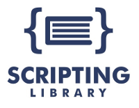

This repository is a collection of scripts published on [SCRIPTING LIBRARY](http://www.scriptinglibrary.com) and created by Paolo Frigo. 

## SCRIPTING LIBRARY
Scripting Library is a collection of scripts and experiences shared by IT Pros, Developers, DevOps and Geeks across Linux and Windows OS with BaSH, PowerShell and Python from all over the world.

## LANGUAGES
* Powershell
* Python
* BaSH
* NodeJS

## LICENSE

This work is licensed under a Creative Commons Attribution 4.0 International License.

## DISCLAIMER
THE SOFTWARE IS PROVIDED *AS IS*, WITHOUT WARRANTY OF ANY KIND, EXPRESS OR 
IMPLIED, INCLUDING BUT NOT LIMITED TO THE WARRANTIES OF MERCHANTABILITY, 
FITNESS FOR A PARTICULAR PURPOSE AND NONINFRINGEMENT. IN NO EVENT SHALL THE 
AUTHORS OR COPYRIGHT HOLDERS BE LIABLE FOR ANY CLAIM, DAMAGES OR OTHER 
LIABILITY, WHETHER IN AN ACTION OF CONTRACT, TORT OR OTHERWISE, ARISING FROM, 
OUT OF OR IN CONNECTION WITH THE SOFTWARE OR THE USE OR OTHER DEALINGS IN THE 
SOFTWARE.

